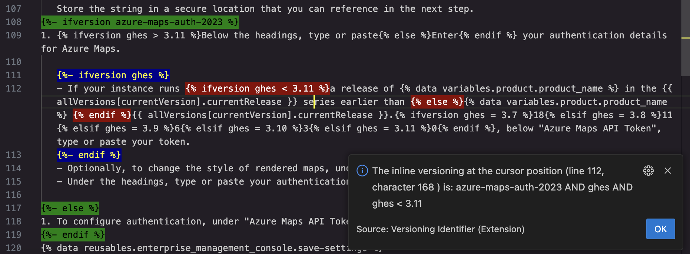

# The version identifier VS Code extension

This extension for VS Code helps you to identify Liquid-syntax tags used to apply versioning in the Markdown files for GitHub documentation.

Here's an example of versioning in GitHub Markdown:

`This text is not versioned, but this only appears in the documentation for GitHub Enterprise Server 3.11 or higher.`

Where there's lots of versioning in a Markdown file, especially where versioning is nested within other versioned blocks, it can be difficult to be absolutely sure, just by looking at the Markdown, which version of the docs a particular bit of text will, or will not, appear in. And if you want to remove some versioning it can be hard to know which tags you need to delete. This extension makes things a lot easier.

## Features

The extension does two things, it:
- Displays a message describing the versioning at the current cursor position within the Markdown file.
- Highlights the version tags that affect the versioning at the cursor position.

There are options for how you want the message to be displayed. You can show the usual popup "toast" message at the bottom right of VS Code, which disappears after a while. Alternatively, you can display a modal popup, which you have to click to dismiss.

## Using the extension

In a Markdown file that contains Liquid version tags, place the cursor in the text for which you want to identify the versioning, then:

- To see the versioning in a "toast" popup, click:
  - <kbd>control</kbd>+<kbd>command</kbd>+<kbd>v</kbd> on MacOS
  - <kbd>alt</kbd>+<kbd>j</kbd> on Windows

- To see the versioning in a modal dialog, click:
  - <kbd>shift</kbd>+<kbd>control</kbd>+<kbd>command</kbd>+<kbd>v</kbd> on MacOS
  - <kbd>shift</kbd>+<kbd>alt</kbd>+<kbd>j</kbd> on Windows

Alternatively, go to the Command Palette (<kbd>Ctrl</kbd>+<kbd>Shift</kbd>+<kbd>p</kbd> (Windows/Linux) or <kbd>Shift</kbd>+<kbd>command</kbd>+<kbd>p</kbd> (Mac)), type `version` and select either **Versioning identification (Toast)** or **Versioning identification (Modal)**.

The extension highlights each set of tags that affects the current cursor position in a different color. In this example, the cursor is in the word "series" on line 112. The text at that point is within a set of tags that's nested within another tag set, that's also nested. So three sets of tags are highlighted. The "toast" popup describes the versioning.



## Extension settings

You can change the settings for the tag highlighting and the keyboard shortcuts you use to run the extension.

### Tag highlighting colors

The extension uses an array of color pairs (that is, the background color and the color of the text) to highlight the version tags. You can change the colors by editing the `versionIdentifier.colors` setting in your `settings.json` file.

To change the highlighing colors:

1. Open the VS Code settings editor (<kbd>Ctrl</kbd>+<kbd>,</kbd> (Windows/Linux) or <kbd>command</kbd>+<kbd>,</kbd> (Mac)).
1. Search for `version`.
1. Under "Version-identifier: Color Pairs", click **Edit in settings.json**.
1. Change the colors in the `versionIdentifier.colors` array as required. For example:

   ```json
       "version-identifier.colorPairs": [
        {
            "backgroundColor": "orange",
            "color": "blue"
        },
        {
            "backgroundColor": "yellow",
            "color": "red"
        },
        {
            "backgroundColor": "green",
            "color": "black"
        }
    ]
    ```

### Keyboard shortcuts

To change the default keyboard shortcuts:

1. Open the command palette (<kbd>Ctrl</kbd>+<kbd>Shift</kbd>+<kbd>p</kbd> (Windows/Linux) or <kbd>Shift</kbd>+<kbd>command</kbd>+<kbd>p</kbd> (Mac)).
1. Search for `shortcut`.
1. Select **Preferences: Open Keyboard Shortcuts** (note: not **Preferences: Open Keyboard Shortcuts (JSON)**).
1. Search for `versioning`.
1. Hover over **Versioning identification (Toast)** or **Versioning identification (Modal)** and click the pencil icon to the left of the command name.
1. Press the key combination you want to use for the command, then press Enter.

The new shortcut is immediately available for use.

## How the extension was coded

For a description of how the Typescript code behind this extension works, see the [code-description.md](https://github.com/docs/version-identifier/blob/main/code-description.md) file.

## Known issues

None.

## Release notes

For details of the changes in each release, See the [CHANGELOG.md](https://github.com/docs/version-identifier/blob/main/CHANGELOG.md) file.
